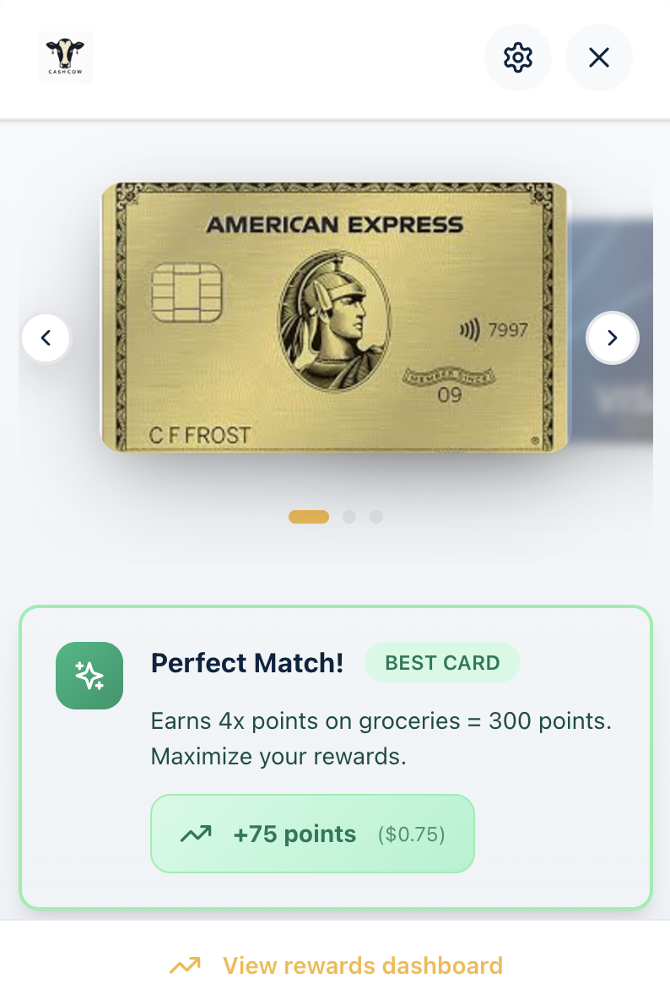

# Cash Cow

An **AI-powered Chrome extension** that maximizes credit card rewards by recommending the optimal card at checkout. This project explores how combining **large language models**, **web scraping**, and **browser automation** can create intelligent financial decision tools.

## Overview

Cash Cow analyzes checkout pages in real-time and uses **Anthropic Claude** via a **Fetch.AI agent** to classify merchants into reward categories. The extension then calculates expected value across 13+ credit cards using **real reward data scraped from BrightData**, recommending the card that maximizes points or cashback for each transaction.

The goal is to understand:
- How LLMs can classify merchants more intelligently than rule-based systems
- How scraped credit card data can power personalized financial recommendations
- How Chrome extensions can integrate AI agents for real-time decision making
- How to build privacy-first browser tools that process data locally

The extension works like **Honey** or **Rakuten**, but instead of finding coupon codes, it finds the optimal payment method based on your wallet.

## Features

- **AI-Powered Merchant Classification** – Claude AI classifies merchants into reward categories (dining, e-commerce, groceries, gas, travel, etc.)
- **Real Credit Card Data** – Scraped reward structures from 13+ real credit cards via BrightData
- **Smart Checkout Detection** – Automatically detects when you're at a payment page and extracts transaction amounts
- **Expected Value Calculations** – Computes `amount × reward rate` to rank cards by potential earnings
- **Popup Recommendations** – Shows best card with detailed rationale and interactive card carousel
- **Badge Notifications** – Extension icon displays "!" when checkout is detected
- **Keyboard Shortcuts** – Press `Ctrl+Shift+H` to open recommendations instantly
- **Privacy-First Architecture** – All processing happens locally; no transaction data leaves your browser

## Screenshots

### Extension in Action
*Screenshot showing the extension popup with card recommendations*



### Rewards Dashboard
*Visual analytics showing your total savings and rewards earned over time*


## How It Works

**1. Content Script** (`src/pages/content/amazon-amount.js`)
- Runs on all pages and detects checkout states
- Extracts merchant name from URL and transaction amount from DOM
- Only activates on known merchant sites (Amazon, Uber Eats, DoorDash, etc.)
- Sends `CHECKOUT_DETECTED` message to background worker

**2. Background Service Worker** (`src/pages/background/index.ts`)
- Listens for checkout detection events
- Updates extension badge with "!" notification
- Handles keyboard shortcuts (`Ctrl+Shift+H`)
- Manages Chrome runtime messaging between content scripts and popup

**3. Agent Server** (`server/agent.py`)
- FastAPI server running on `localhost:8080`
- Integrates with Anthropic Claude API for merchant classification
- Classifies merchant domains into reward categories:
  - **DINING** – Restaurants, food delivery (Uber Eats, DoorDash)
  - **E-COMMERCE** – Online shopping (Amazon, eBay)
  - **GROCERIES** – Grocery stores (Walmart, Costco)
  - **GAS** – Gas stations (Shell, Chevron, Exxon)
  - **TRAVEL** – Airlines, hotels, booking sites
  - **ENTERTAINMENT** – Streaming, music, events
  - **FINANCE** – Banks, payment processors
  - **ONLINE** – Digital services and purchases
  - **OTHER** – Miscellaneous merchants

**4. Recommendation Engine** (`src/lib/rewards/`)
- Loads 13+ real credit cards from BrightData JSON file
- Extracts reward rates by category (e.g., 3% on dining, 2% on groceries)
- Calculates expected value: `transaction_amount × category_reward_rate`
- Sorts cards by expected reward value (highest first)
- Provides detailed rationale for each recommendation

**5. Web Scraper** (`server/scraper.py`)
- Scrapes credit card reward data from financial websites
- Extracts card names, issuers, reward rates, annual fees, and benefits
- Outputs structured JSON for the recommendation engine

## Setup

### Prerequisites

- **Node.js 18+**
- **Python 3.10+** with `pydantic v1`
- **Chrome browser**
- **Anthropic Claude API key**
- **BrightData API key** (for scraping credit card data)

### Installation

1. Clone the repository:
```bash
git clone https://github.com/marcosarnold/cash-cow.git
cd cash-cow
```

2. Install dependencies:
```bash
npm install
cd server
pip install -r requirements.txt
cd ..
```

3. Configure API keys:

Create a `.env` file in the `server/` directory:
```
ANTHROPIC_API_KEY=your-anthropic-api-key-here
BRIGHTDATA_API_KEY=your-brightdata-api-key-here
```

4. Start the agent server:
```bash
cd server
python agent.py
```

The server will run on `http://localhost:8080`

5. Build the extension:
```bash
npm run build
```

6. Load in Chrome:
   - Navigate to `chrome://extensions/`
   - Enable **"Developer mode"** (top right)
   - Click **"Load unpacked"**
   - Select the `dist` folder

## Running the Extension

1. **Start the agent server:**
```bash
cd server
python agent.py
```

2. **Visit a supported merchant** (e.g., Amazon, Uber Eats, DoorDash)

3. **Add items to cart** and proceed to checkout

4. **Open the extension:**
   - Click the Cash Cow icon in your toolbar, OR
   - Press `Ctrl+Shift+H`

5. **View recommendations** showing:
   - Best card for the current merchant
   - Expected rewards/cashback
   - All cards ranked by value
   - Detailed rationale for the recommendation

## Supported Merchants

The extension currently supports major e-commerce and service platforms:

- **E-commerce**: Amazon.com
- **Food Delivery**: Uber Eats, DoorDash, Grubhub
- **Groceries**: Costco, Walmart
- **Gas Stations**: Shell, Chevron, Exxon
- **Travel**: Airlines, booking sites (via AI classification)
- **Streaming**: Netflix, Spotify (via AI classification)

Additional merchants are supported through Claude AI's intelligent classification system.

## Technologies Used

- **React + TypeScript** – Modern UI framework with type safety
- **Tailwind CSS** – Utility-first styling
- **Vite** – Fast build tool for Chrome MV3 extensions
- **Anthropic Claude** – LLM for intelligent merchant classification
- **FastAPI** – Python web framework for the agent server
- **BrightData** – Web scraping platform for credit card reward data
- **Chrome Extensions API** – Manifest V3 for modern browser extensions

## Limitations & Future Work

**Current Limitations:**
- Requires local agent server running on `localhost:8080`
- Only supports pre-defined merchant sites (extensible via AI)
- Uses mock card data (real scraping requires BrightData subscription)
- No real banking integrations (privacy-first design)
- Desktop Chrome only (no mobile support yet)

**Potential Improvements:**
- Hosted agent server for easier deployment
- Mobile Chrome support via React Native
- Integration with Plaid for real card balances
- Support for loyalty programs and transfer partners
- Historical spending analysis for personalized recommendations
- Support for debit cards and digital wallets

## License

MIT License
